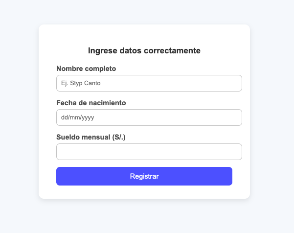

# 🧾 Proyecto Java Servlet – Validación de Formulario con AJAX

Este proyecto es una aplicación Java basada en **Servlets** y **HTML + JavaScript**, que permite validar datos de un formulario de registro de empleado. Se utiliza **AJAX** para enviar los datos al backend sin recargar la página, mejorando notablemente la experiencia del usuario.

---

## 🚀 Tecnologías utilizadas

- Java (Servlets con Jakarta EE)
- HTML5 / CSS3
- JavaScript / jQuery
- AJAX
- Flatpickr (Selector de fechas moderno)
- Servidor Apache Tomcat (o similar)

---

## 🎯 Funcionalidad

El usuario debe ingresar:

- Nombre completo.
- Fecha de nacimiento (con Flatpickr).
- Sueldo mensual.

El formulario valida esta información en el backend (`ValidaServlet.java`) y devuelve mensajes de validación (positivos o errores), los cuales se muestran dinámicamente en la misma página sin recargarla.

---

## 📂 Estructura del proyecto

```bash

styp.com.lab01/
├── ValidaServlet.java # Servlet que valida los datos del formulario
webapp/
├── index.html # Formulario HTML con AJAX
└── jq/ # Carpeta donde se encuentra jQuery
```


---

## 🧠 Explicación del flujo

1. El usuario rellena el formulario en `index.html`.
2. Al presionar "Registrar", jQuery intercepta el envío (`#formulario.submit`) y evita el comportamiento clásico.
3. Se envía la información al servlet `ValidaServlet` mediante AJAX (`POST`).
4. El servlet valida los datos:
    - **Nombre**: no debe estar vacío.
    - **Fecha de nacimiento**: debe tener el formato `yyyy-MM-dd` y ser válida.
    - **Sueldo**: debe ser un número positivo.
5. La respuesta HTML se muestra dentro del contenedor `<div id="msg">` sin recargar la página.

---

## 💡 ¿Por qué usamos AJAX?

AJAX permite enviar datos al servidor y obtener respuestas **sin recargar la página**. Esto hace que la experiencia sea:

| Ventaja                         | Explicación |
|----------------------------------|-------------|
| 🔄 Sin recargas                  | Se evita que el navegador vuelva a renderizar toda la página. |
| ⚡ Más rápido                    | Se envía solo la información necesaria. |
| 🎯 Mejor control                | Puedes mostrar solo los resultados, sin redireccionar. |
| 🧪 Ideal para validaciones en tiempo real | Puedes mostrar mensajes de error o éxito rápidamente. |

---

## 🧩 Fragmento del Servlet principal (`ValidaServlet.java`)

```java
@WebServlet(name = "validaServlet", urlPatterns = "/valida")
public class ValidaServlet extends HttpServlet {
    @Override
    protected void doGet(HttpServletRequest request, HttpServletResponse response) throws ServletException, IOException {
        // Obtiene los parámetros
        String nombre = request.getParameter("nombre");
        String nacimiento = request.getParameter("nacimiento");
        String sueldo = request.getParameter("sueldo");
        ...
        // Devuelve HTML con mensajes de validación
    }

    @Override
    protected void doPost(HttpServletRequest request, HttpServletResponse response) throws ServletException, IOException {
        // Redirige al método GET para manejar AJAX por POST
        doGet(request, response);
    }
}
```

## 🧾 Fragmento clave de index.html

```html
<form id="formulario" action="valida" method="post">
    <label for="nombre">Nombre completo</label>
    <input type="text" id="nombre" name="nombre">

    <label for="nacimiento">Fecha de nacimiento</label>
    <input type="text" id="nacimiento" name="nacimiento">

    <label for="sueldo">Sueldo</label>
    <input type="number" id="sueldo" name="sueldo">

    <input type="submit" value="Registrar">
</form>
```

## 🔧 Requisitos y ejecución del proyecto

Para ejecutar esta aplicación necesitas:

- ☕ Tener **JDK 17** o superior instalado.
- 🐳 Tener instalado **Docker** y **Docker Compose** en tu sistema.
- 📁 Incluir la carpeta `jq/` que contenga `jquery-3.3.1.min.js` en el mismo nivel que tu archivo `index.html`.
- ✅ Tener configurado correctamente el archivo `Dockerfile` y `docker-compose.yml` para ejecutar el proyecto en un contenedor Jakarta EE (por ejemplo, Tomcat 10+).

### ▶️ Pasos para compilar y ejecutar

1. 📦 Compilar el proyecto con Maven:
   ```bash
   mvn clean package
   ```
2. 🚀 Construir y ejecutar los contenedores:

   ```bash
   docker-compose up --build -d
   ```
   
3. Una vez iniciado, puedes acceder a tu aplicación web desde:
   ```arduino
   http://localhost:8081/
   ```

---

## ✨ Mejoras futuras

- 🔄 Permitir respuestas en **JSON** para separar la lógica del backend de la presentación en frontend.
- ✅ Implementar **validaciones en el cliente** antes de enviar el formulario.
- 💾 Integración con **base de datos** mediante **JDBC** para almacenar los datos ingresados.
- 🔐 Agregar **mecanismos de sesión** o **autenticación de usuarios**.

---

## 🖼️ Vista previa de funcionamiento

A continuación, se muestra una imagen de ejemplo del formulario en ejecución utilizando AJAX y Flatpickr:



## 📅 ¿Qué es Flatpickr?

**Flatpickr** es una biblioteca liviana de JavaScript para seleccionar fechas de manera visual y amigable.

En este proyecto, se ha integrado Flatpickr para:

- 📆 Facilitar la selección de **fecha de nacimiento** del empleado.
- 🚫 Evitar errores al escribir fechas manualmente.
- 🌍 Adaptar el selector al idioma **español**.
- ✅ Establecer un formato compatible con el backend (`yyyy-MM-dd`).

### 🔧 Configuración utilizada

```javascript
flatpickr("#nacimiento", {
    dateFormat: "Y-m-d",     // Formato enviado al backend (yyyy-MM-dd)
    altInput: true,          // Muestra una fecha amigable al usuario
    altFormat: "d/m/Y",      // Formato visible (dd/MM/yyyy)
    maxDate: "today",        // Impide fechas futuras
    locale: "es"             // Idioma español
});
```


---

## 📬 Autor

Desarrollado por **Styp Canto** como parte de ejercicios de aprendizaje con **Java Servlets**, **AJAX**, y tecnologías web modernas.

